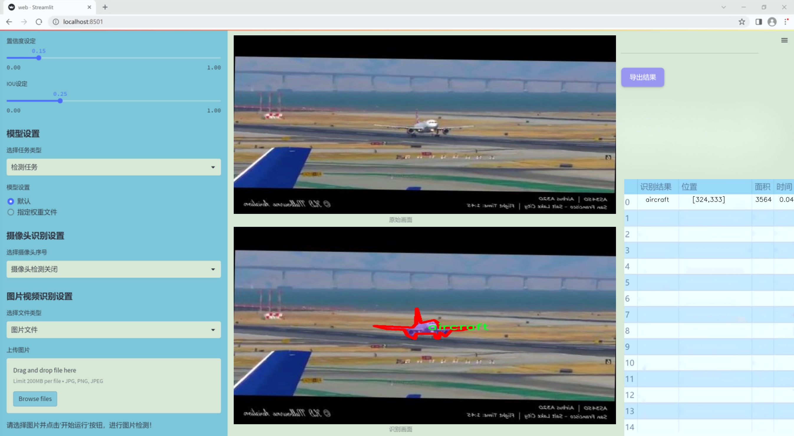
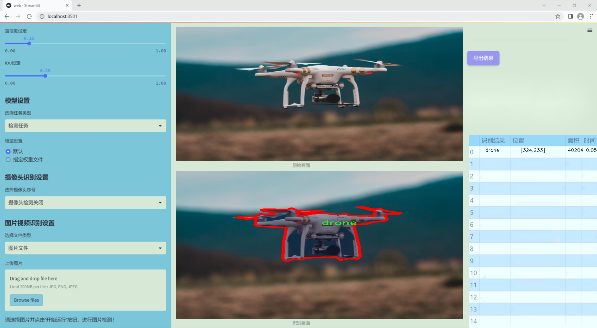
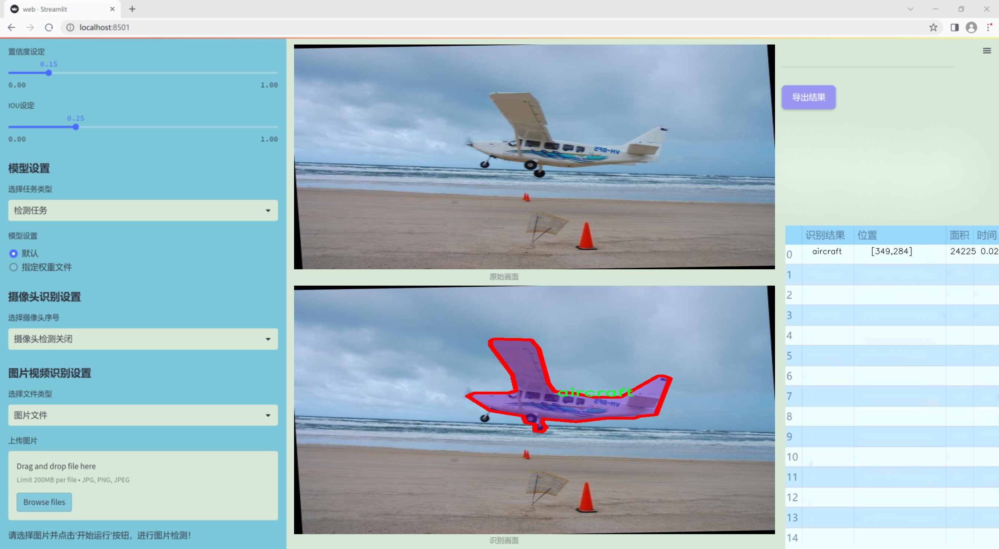
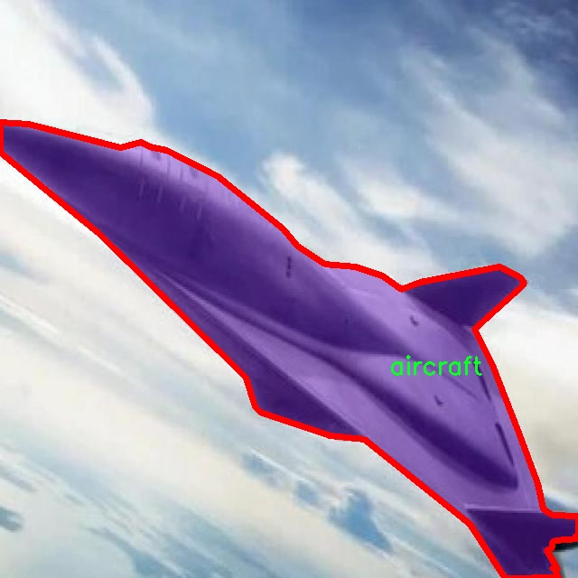
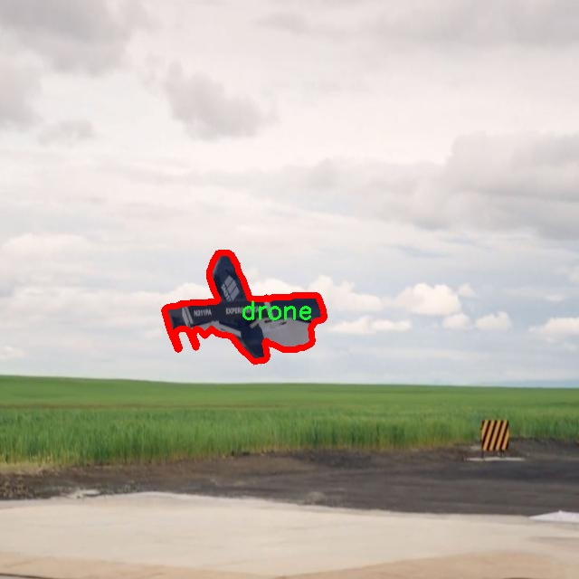
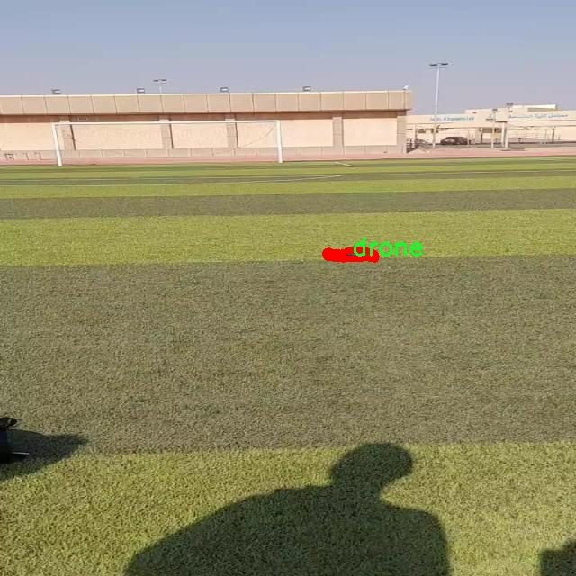

### 1.背景意义

研究背景与意义

随着无人机技术的迅猛发展，空中目标检测在军事、民用和环境监测等领域的应用日益广泛。无人机不仅可以用于监视和侦察，还能在灾害救援、交通监控以及生态保护等方面发挥重要作用。因此，构建一个高效、准确的空中目标检测系统显得尤为重要。现有的目标检测算法在处理复杂环境下的目标识别时，往往面临着准确率低、实时性差等问题，亟需通过改进算法来提升其性能。

本研究旨在基于改进的YOLOv11算法，开发一个针对空中目标的检测系统。该系统将专注于识别三类目标：飞机、鸟类和无人机。这三类目标在空中场景中具有不同的特征和行为模式，针对性地优化检测算法，将有助于提高系统的整体识别能力。为此，我们将利用包含4500张图像的“Drone_Bird_Aircraft”数据集进行训练和测试。该数据集不仅涵盖了多种空中目标，还提供了丰富的标注信息，为模型的训练提供了坚实的基础。

在技术层面，YOLO系列算法以其高效的实时检测能力和较高的准确率受到广泛关注。通过对YOLOv11的改进，我们将结合最新的深度学习技术，探索更为精细的特征提取和目标定位方法，以提升模型在复杂空中环境中的表现。此外，针对不同目标的特征差异，我们将设计特定的训练策略，以实现更为精准的目标检测。

本研究的成果不仅将推动空中目标检测技术的发展，还将为相关领域的应用提供理论支持和实践指导。通过构建一个高效的空中目标检测系统，我们希望能够为无人机的智能化应用提供更为可靠的技术保障，从而促进无人机技术的广泛应用与发展。

### 2.视频效果

[2.1 视频效果](https://www.bilibili.com/video/BV183qzYbErF/)

### 3.图片效果







##### [项目涉及的源码数据来源链接](https://kdocs.cn/l/cszuIiCKVNis)**

注意：本项目提供训练的数据集和训练教程,由于版本持续更新,暂不提供权重文件（best.pt）,请按照6.训练教程进行训练后实现上图演示的效果。

### 4.数据集信息

##### 4.1 本项目数据集类别数＆类别名

nc: 3
names: ['aircraft', 'bird', 'drone']


该项目为【图像分割】数据集，请在【训练教程和Web端加载模型教程（第三步）】这一步的时候按照【图像分割】部分的教程来训练

##### 4.2 本项目数据集信息介绍

本项目数据集信息介绍

本项目所使用的数据集专注于空中目标检测，旨在为改进YOLOv11算法提供丰富的训练素材。数据集的主题为“Drone_Bird_Aircraft”，涵盖了三种主要类别：飞机（aircraft）、鸟类（bird）和无人机（drone）。这些类别的选择不仅反映了现代空中交通的多样性，也为算法在复杂环境中的应用提供了广泛的测试场景。

在数据集的构建过程中，研究团队精心收集了来自不同环境和条件下的图像，以确保数据的多样性和代表性。飞机类图像包括商用飞机、私人飞机及军用飞机等多种类型，涵盖了不同的飞行高度和角度；鸟类图像则选取了多种常见鸟类的飞行状态，旨在模拟自然环境中的空中目标；无人机类图像则包括了多种型号的无人机，反映了当前无人机技术的快速发展。

数据集的设计考虑到了不同光照、天气条件及背景复杂度对目标检测的影响，使得训练出的模型能够在各种实际应用场景中保持高效的检测性能。通过对这三类目标的深入分析与研究，数据集不仅为算法的训练提供了基础，也为后续的性能评估和优化奠定了坚实的基础。

总之，本项目的数据集在类别数量和多样性上均表现出色，旨在为空中目标检测领域的研究提供有力支持。通过使用这一数据集，研究人员希望能够显著提升YOLOv11在空中目标检测任务中的准确性和鲁棒性，为无人机监控、航空安全等应用领域的进一步发展做出贡献。








### 5.全套项目环境部署视频教程（零基础手把手教学）

[5.1 所需软件PyCharm和Anaconda安装教程（第一步）](https://www.bilibili.com/video/BV1BoC1YCEKi/?spm_id_from=333.999.0.0&vd_source=bc9aec86d164b67a7004b996143742dc)


[5.2 安装Python虚拟环境创建和依赖库安装视频教程（第二步）](https://www.bilibili.com/video/BV1ZoC1YCEBw?spm_id_from=333.788.videopod.sections&vd_source=bc9aec86d164b67a7004b996143742dc)

### 6.改进YOLOv11训练教程和Web_UI前端加载模型教程（零基础手把手教学）

[6.1 改进YOLOv11训练教程和Web_UI前端加载模型教程（第三步）](https://www.bilibili.com/video/BV1BoC1YCEhR?spm_id_from=333.788.videopod.sections&vd_source=bc9aec86d164b67a7004b996143742dc)


按照上面的训练视频教程链接加载项目提供的数据集，运行train.py即可开始训练



     Epoch   gpu_mem       box       obj       cls    labels  img_size
     1/200     20.8G   0.01576   0.01955  0.007536        22      1280: 100%|██████████| 849/849 [14:42<00:00,  1.04s/it]
               Class     Images     Labels          P          R     mAP@.5 mAP@.5:.95: 100%|██████████| 213/213 [01:14<00:00,  2.87it/s]
                 all       3395      17314      0.994      0.957      0.0957      0.0843

     Epoch   gpu_mem       box       obj       cls    labels  img_size
     2/200     20.8G   0.01578   0.01923  0.007006        22      1280: 100%|██████████| 849/849 [14:44<00:00,  1.04s/it]
               Class     Images     Labels          P          R     mAP@.5 mAP@.5:.95: 100%|██████████| 213/213 [01:12<00:00,  2.95it/s]
                 all       3395      17314      0.996      0.956      0.0957      0.0845

     Epoch   gpu_mem       box       obj       cls    labels  img_size
     3/200     20.8G   0.01561    0.0191  0.006895        27      1280: 100%|██████████| 849/849 [10:56<00:00,  1.29it/s]
               Class     Images     Labels          P          R     mAP@.5 mAP@.5:.95: 100%|███████   | 187/213 [00:52<00:00,  4.04it/s]
                 all       3395      17314      0.996      0.957      0.0957      0.0845


###### [项目数据集下载链接](https://kdocs.cn/l/cszuIiCKVNis)

### 7.原始YOLOv11算法讲解


##### YOLOv11三大损失函数

YOLOv11（You Only Look Once）是一种流行的目标检测算法，其损失函数设计用于同时优化分类和定位任务。YOLO的损失函数通常包括几个部分：
**分类损失、定位损失（边界框回归损失）和置信度损失** 。其中，

  1. box_loss（边界框回归损失）是用于优化预测边界框与真实边界框之间的差异的部分。

  2. cls_loss（分类损失）是用于优化模型对目标类别的预测准确性的部分。分类损失确保模型能够正确地识别出图像中的对象属于哪个类别。

  3. dfl_loss（Distribution Focal Loss）是YOLO系列中的一种损失函数，特别是在一些改进版本如YOLOv5和YOLOv7中被引入。它的主要目的是解决目标检测中的类别不平衡问题，并提高模型在处理小目标和困难样本时的性能。

##### 边界框回归损失详解

box_loss（边界框回归损失）是用于优化预测边界框与真实边界框之间的差异的部分。


##### box_loss 的具体意义


##### 为什么需要 box_loss

  * 精确定位：通过最小化中心点坐标损失和宽高损失，模型能够更准确地预测目标的位置和大小。
  * 平衡不同类型的目标：使用平方根来处理宽高损失，可以更好地平衡不同大小的目标，确保小目标也能得到足够的关注。
  * 稳定训练：适当的损失函数设计有助于模型的稳定训练，避免梯度爆炸或消失等问题。

##### 分类损失详解

在YOLO（You Only Look
Once）目标检测算法中，cls_loss（分类损失）是用于优化模型对目标类别的预测准确性的部分。分类损失确保模型能够正确地识别出图像中的对象属于哪个类别。下面是关于cls_loss的详细解读：

##### 分类损失 (cls_loss) 的具体意义

  
分类损失通常使用交叉熵损失（Cross-Entropy
Loss）来计算。交叉熵损失衡量的是模型预测的概率分布与真实标签之间的差异。在YOLO中，分类损失的具体形式如下：


##### 为什么需要 cls_loss

  * 类别识别：cls_loss 确保模型能够正确识别出图像中的目标属于哪个类别。这对于目标检测任务至关重要，因为不仅需要知道目标的位置，还需要知道目标的类型。

  * 多类别支持：通过最小化分类损失，模型可以处理多个类别的目标检测任务。例如，在道路缺陷检测中，可能需要识别裂缝、坑洞、路面破损等多种类型的缺陷。

  * 提高准确性：分类损失有助于提高模型的分类准确性，从而提升整体检测性能。通过优化分类损失，模型可以更好地学习不同类别之间的特征差异。

##### 分布损失详解

`dfl_loss`（Distribution Focal
Loss）是YOLO系列中的一种损失函数，特别是在一些改进版本如YOLOv5和YOLOv7中被引入。它的主要目的是解决目标检测中的类别不平衡问题，并提高模型在处理小目标和困难样本时的性能。下面是对`dfl_loss`的详细解读：

##### DFL Loss 的背景

在目标检测任务中，类别不平衡是一个常见的问题。某些类别的样本数量可能远远多于其他类别，这会导致模型在训练过程中对常见类别的学习效果较好，而对罕见类别的学习效果较差。此外，小目标和困难样本的检测也是一个挑战，因为这些目标通常具有较少的特征信息，容易被忽略或误分类。

为了应对这些问题，研究者们提出了多种改进方法，其中之一就是`dfl_loss`。`dfl_loss`通过引入分布焦点损失来增强模型对困难样本的关注，并改善类别不平衡问题。

##### DFL Loss 的定义

DFL Loss
通常与传统的交叉熵损失结合使用，以增强模型对困难样本的学习能力。其核心思想是通过对每个类别的预测概率进行加权，使得模型更加关注那些难以正确分类的样本。

DFL Loss 的公式可以表示为：


##### DFL Loss 的具体意义**

  * **类别不平衡：** 通过引入平衡因子 α，DFL Loss 可以更好地处理类别不平衡问题。对于少数类别的样本，可以通过增加其权重来提升其重要性，从而提高模型对这些类别的检测性能。
  *  **困难样本：** 通过聚焦参数 γ，DFL Loss 可以让模型更加关注那些难以正确分类的样本。当 
  * γ 较大时，模型会对那些预测概率较低的样本给予更多的关注，从而提高这些样本的分类准确性。
  *  **提高整体性能** ：DFL Loss 结合了传统交叉熵损失的优势，并通过加权机制增强了模型对困难样本的学习能力，从而提高了整体的检测性能。


### 8.200+种全套改进YOLOV11创新点原理讲解

#### 8.1 200+种全套改进YOLOV11创新点原理讲解大全

由于篇幅限制，每个创新点的具体原理讲解就不全部展开，具体见下列网址中的改进模块对应项目的技术原理博客网址【Blog】（创新点均为模块化搭建，原理适配YOLOv5~YOLOv11等各种版本）

[改进模块技术原理博客【Blog】网址链接](https://gitee.com/qunmasj/good)


#### 8.2 精选部分改进YOLOV11创新点原理讲解

###### 这里节选部分改进创新点展开原理讲解(完整的改进原理见上图和[改进模块技术原理博客链接](https://gitee.com/qunmasj/good)【如果此小节的图加载失败可以通过CSDN或者Github搜索该博客的标题访问原始博客，原始博客图片显示正常】

### AutoFocus: Efficient Multi-Scale Conv简介

参考该博客提出了AutoFocus，一种高效的多尺度目标检测算法。相较于以前对整个图像金字塔进行处理，该方法以一种由表及里的姿态，仅处理哪些整体上看来很有可能存在小物体的区域。这个可以通过预测一张类别未知的分割图FocusPixels来得到。为了高效利用FocusPixels，另外一个算法用于产生包含FocusPixels的FocusChips，这样可以减少计算量并处理更更精细的尺度。在不同尺度上FocusChips所得到的检测结果综合时，会出现问题，我们也提供了解决问题的方案。AutoFocus在COCO上的结果有49.7%mAP（50%重叠下68.3%），与多尺度baseline相仿但是快了2.5倍。金字塔中处理的像素数量减少了5倍mAP只下降1%，在与RetinaNet采用相同的ResNet-101结构且速度相同时，高了10%mAP。

人类寻找物体是一个动态的过程，且寻找时间与场景的复杂度是直接相关的。当我们的眼神在不同的点之间漂移时，其他的区域会被我们有意忽视。然而，现在的检测算法是一种静态的推理过程且图像金字塔中的每个像素都受到了一样的对待，这使得过程变得没有效率。现在许多的应用都不强调实时性，而计算上的节省其实可以产生很大收益。

在COCO数据集中，虽然40%的物体都是小物体，但是它们一共只占了全图的0.3%。如果金字塔是3倍关系，则在高分辨率层要进行9倍的运算。XXX 。那么有没有办法在低分辨率下找出可能含有这些物体的区域呢？

以人眼方案类比，我们可以从低分辨率图像开始，找出有可能存在物体的区域再“聚集”到高分辨率。我们的AutoFocus会在一层中计算小物体的分割图FocusPixels，而在每一个FocusPixels上会用一个算法产生下一层所需要关注的chips。在COCO的最大分辨率层上我们可以只处理**20%的像素而性能不下降，如果只处理5%**也只下降1%而已。


图像金字塔与卷积神经网络对CV十分重要。然而卷积神经网络无法做到对尺度不敏感，所以为了不同大小的物体需要依赖图像金字塔。虽然训练已经有了高效的方法，但是其推断时间依然远离实际使用标准。

目标检测加速有很长历史了。常用的有特征近似以减少尺度、级联、特征金字塔，且最后一个最近很多人研究。

AutoFocus为速度与精度之间提供了一个平滑的折衷，指出可以在低分辨率下看出小物体的所在，从而节约计算。FocusPixels的计算较为容易。

先简单介绍一下SNIP，是一种多尺度的训练、推断算法。主要思想是训练针对某个特定scale的检测器而不是scale-invariant检测器。这样训练样本就局限于在某个尺度范围内，以适于这个检测器处理。比如在高分辨率仅处理小物体而高分辨率仅处理大物体，其优势在于训练时不用考虑尺度的变化。

由于训练时物体大小是已知的，我们在图像金字塔中可以忽略大量区域而只处理物体周围的区域。SNIPER说明这样低分辨率的训练与全图训练相比并不会降低性能。同样，在推断过程中如果可以在大分辨率图像上预测可能出现小物体的chip，我们也就不用处理整张高分辨率图片。在训练时，许多物体会被裁剪、扭曲，这可以当作是一种数据扩增，然而当这个情况在推断时出现，则会产生错误，所以我们还需要一个算法来整合不同尺度上的检测结果。

#### AutoFocus框架
如SIFT、SURF等传统分类特征包含两个组件，一个detector和一个descriptor。detector只包含轻量级的操作如DoG、LoG，用于在整张图片上找到感兴趣的区域；descriptor，一般来说计算量比较大，则只需要关注那些咸兴趣的区域。这个级联结构保障了图片处理的效率。

同样，AutoFocus框架也是用于预测感兴趣的区域，并丢弃在下一尺度不可能存在物体的区域，并将裁剪和缩放后的区域传递给下一尺度。AutoFocus由三个部分组成：FocusPixels，FocusChips和focus stacking。

#### FocusPixels
FocusPixels定义在卷积网络特征图的粒度之上（如conv5），如果特征图上某个像素与小物体有重叠则标注为一个FocusPixel。（小物体：面积处于一个网络的输入范围之内）。训练过程中，FocusPixels标注为正，某些与不在面积范围内的物体有重叠的像素标注为无效，其他像素标注为负。AutoFocus的训练目标是使在FocusPixels区域产生较大的激活值。

如果同时多个物体与同一像素重叠，优先给正标注。我们的网络输入是512x512，然后a,b,c取值分别是5,64,90。对于太大或太小的物体，我们认为当前尺度上没有足够人信息进行判断，所以会标定为无效。整个网络结构如下图。训练时加两层带ReLU的卷积(3x3和1x1)以及一个二分类softmax来预测FocusPixels。


#### FocusChip生成
推断过程中，我们标注输出概率大于阈值t的像素（这个参数可以控制加速比），得到一些连通域。对于每一个域，我们做一次膨胀使其包含一些有助于识别的周围信息，膨胀后相连的部分要合并。然后，我们生成一些包含连通域的chips（不同chips可能重叠，如有重叠则合并）。有些chip可能太小缺少必要信息，并使chip的大小变化很大，为了效率我们要求保证一个最小的chip size。算法流程如下：


#### 级联推断过程
我们的过程类似于图片金字塔的推断过程但是在过程中一步步去除不关注的图片区域。我们在最低分辨率上进行检测并生成chips，然后在这些chips再进行检测和生成chips。

#### Focus Stacking
这种级联分类器的一个问题是在chip边缘本来的大物体可能生成一些被剪裁的检测目标。在下一个尺度上，由于剪裁过了，所以会检测到小的、错误的正例False Positive。之前算法中的第二步膨胀其实就是为了保证没有物体会出现在chip的边缘。这样，当我们在局部图片chip的边缘检测到物体时，就可以把这个检测结果丢弃，即使其在SNIP的范围内。

也有一些物体在图片边缘的特殊情况。如果chip和图片共享一条边的话，我们会检查检测结果的其他边是否完全在里面，如果在，则保留它，否则丢弃。

在每一尺度得到有效检测结果后，我们可以将不同尺度上的结果进行整合，将这些结果映射到原图坐标系上。最后，非极大值抑制NMS用于聚集。网络结构如之前的图片所示。


### 9.系统功能展示

图9.1.系统支持检测结果表格显示

  图9.2.系统支持置信度和IOU阈值手动调节

  图9.3.系统支持自定义加载权重文件best.pt(需要你通过步骤5中训练获得)

  图9.4.系统支持摄像头实时识别

  图9.5.系统支持图片识别

  图9.6.系统支持视频识别

  图9.7.系统支持识别结果文件自动保存

  图9.8.系统支持Excel导出检测结果数据


### 10. YOLOv11核心改进源码讲解

#### 10.1 wtconv2d.py

以下是对代码中最核心部分的提取和详细中文注释：

```python
import torch
import torch.nn as nn
import torch.nn.functional as F
from torch.autograd import Function
import pywt

# 创建小波滤波器
def create_wavelet_filter(wave, in_size, out_size, type=torch.float):
    # 使用PyWavelets库创建小波对象
    w = pywt.Wavelet(wave)
    
    # 反转小波的分解高通和低通滤波器
    dec_hi = torch.tensor(w.dec_hi[::-1], dtype=type)
    dec_lo = torch.tensor(w.dec_lo[::-1], dtype=type)
    
    # 创建分解滤波器
    dec_filters = torch.stack([
        dec_lo.unsqueeze(0) * dec_lo.unsqueeze(1),
        dec_lo.unsqueeze(0) * dec_hi.unsqueeze(1),
        dec_hi.unsqueeze(0) * dec_lo.unsqueeze(1),
        dec_hi.unsqueeze(0) * dec_hi.unsqueeze(1)
    ], dim=0)

    # 扩展滤波器以适应输入通道数
    dec_filters = dec_filters[:, None].repeat(in_size, 1, 1, 1)

    # 反转小波的重构高通和低通滤波器
    rec_hi = torch.tensor(w.rec_hi[::-1], dtype=type).flip(dims=[0])
    rec_lo = torch.tensor(w.rec_lo[::-1], dtype=type).flip(dims=[0])
    
    # 创建重构滤波器
    rec_filters = torch.stack([
        rec_lo.unsqueeze(0) * rec_lo.unsqueeze(1),
        rec_lo.unsqueeze(0) * rec_hi.unsqueeze(1),
        rec_hi.unsqueeze(0) * rec_lo.unsqueeze(1),
        rec_hi.unsqueeze(0) * rec_hi.unsqueeze(1)
    ], dim=0)

    # 扩展滤波器以适应输出通道数
    rec_filters = rec_filters[:, None].repeat(out_size, 1, 1, 1)

    return dec_filters, rec_filters

# 小波变换
def wavelet_transform(x, filters):
    b, c, h, w = x.shape  # 获取输入的形状
    pad = (filters.shape[2] // 2 - 1, filters.shape[3] // 2 - 1)  # 计算填充
    # 使用小波滤波器进行卷积
    x = F.conv2d(x, filters.to(x.dtype).to(x.device), stride=2, groups=c, padding=pad)
    x = x.reshape(b, c, 4, h // 2, w // 2)  # 重塑输出形状
    return x

# 逆小波变换
def inverse_wavelet_transform(x, filters):
    b, c, _, h_half, w_half = x.shape  # 获取输入的形状
    pad = (filters.shape[2] // 2 - 1, filters.shape[3] // 2 - 1)  # 计算填充
    x = x.reshape(b, c * 4, h_half, w_half)  # 重塑输入形状
    # 使用小波滤波器进行转置卷积
    x = F.conv_transpose2d(x, filters.to(x.dtype).to(x.device), stride=2, groups=c, padding=pad)
    return x

# 定义小波变换的自定义函数
class WaveletTransform(Function):
    @staticmethod
    def forward(ctx, input, filters):
        ctx.filters = filters  # 保存滤波器
        with torch.no_grad():
            x = wavelet_transform(input, filters)  # 执行小波变换
        return x

    @staticmethod
    def backward(ctx, grad_output):
        grad = inverse_wavelet_transform(grad_output, ctx.filters)  # 计算梯度
        return grad, None

# 定义小波卷积层
class WTConv2d(nn.Module):
    def __init__(self, in_channels, out_channels, kernel_size=5, stride=1, bias=True, wt_levels=1, wt_type='db1'):
        super(WTConv2d, self).__init__()

        assert in_channels == out_channels  # 输入和输出通道数必须相同

        self.in_channels = in_channels
        self.wt_levels = wt_levels
        self.stride = stride

        # 创建小波滤波器
        self.wt_filter, self.iwt_filter = create_wavelet_filter(wt_type, in_channels, in_channels, torch.float)
        self.wt_filter = nn.Parameter(self.wt_filter, requires_grad=False)
        self.iwt_filter = nn.Parameter(self.iwt_filter, requires_grad=False)

        # 定义基础卷积层
        self.base_conv = nn.Conv2d(in_channels, in_channels, kernel_size, padding='same', stride=1, groups=in_channels, bias=bias)

    def forward(self, x):
        # 小波变换和逆变换的实现
        for i in range(self.wt_levels):
            x = self.wt_function(x)  # 执行小波变换

        # 进行逆小波变换
        for i in range(self.wt_levels-1, -1, -1):
            x = self.iwt_function(x)  # 执行逆小波变换

        x = self.base_conv(x)  # 通过基础卷积层
        return x
```

### 代码核心部分说明：
1. **小波滤波器创建**：`create_wavelet_filter` 函数生成小波变换和逆变换所需的滤波器。
2. **小波变换与逆变换**：`wavelet_transform` 和 `inverse_wavelet_transform` 函数实现了小波变换和逆变换的核心逻辑。
3. **自定义函数**：`WaveletTransform` 类实现了小波变换的前向和反向传播，支持自动求导。
4. **小波卷积层**：`WTConv2d` 类是一个卷积层，结合了小波变换的特性，能够在特征提取中利用小波的多分辨率特性。

这个程序文件`wtconv2d.py`实现了一个基于小波变换的二维卷积层，主要用于图像处理和特征提取。代码中使用了PyTorch框架，结合了小波变换的概念来增强卷积操作的能力。

首先，文件导入了必要的库，包括PyTorch的核心库和小波变换库`pywt`。接着，定义了一个函数`create_wavelet_filter`，用于创建小波滤波器。这个函数接受小波类型、输入通道数和输出通道数作为参数，生成相应的小波分解和重构滤波器。这些滤波器通过小波的高通和低通滤波器的组合生成，并根据输入和输出通道数进行扩展。

接下来，定义了两个函数`wavelet_transform`和`inverse_wavelet_transform`，分别用于执行小波变换和逆小波变换。`wavelet_transform`函数通过卷积操作将输入张量转换为小波域，`inverse_wavelet_transform`则将小波域的张量转换回原始域。

随后，定义了两个类`WaveletTransform`和`InverseWaveletTransform`，这两个类继承自`torch.autograd.Function`，实现了小波变换和逆变换的前向和反向传播。它们的`forward`方法调用了之前定义的变换函数，而`backward`方法则计算梯度。

在`WTConv2d`类中，构造函数初始化了小波卷积层的参数，包括输入和输出通道数、卷积核大小、步幅等。它创建了小波滤波器和逆滤波器，并定义了基础卷积层和多个小波卷积层。`forward`方法实现了整个小波卷积的前向传播过程，首先进行小波变换，然后通过一系列卷积操作处理小波系数，最后进行逆小波变换，得到输出。

此外，`_ScaleModule`类用于实现一个简单的缩放模块，可以对输入进行加权和偏置操作，增强网络的灵活性。

总体来说，这个文件实现了一个创新的卷积层，结合了小波变换的优点，能够更好地捕捉图像中的多尺度特征，适用于图像处理和计算机视觉任务。

#### 10.2 attention.py

以下是经过简化并注释的核心代码部分，主要保留了 `EMA`, `SimAM`, `SpatialGroupEnhance`, `TopkRouting`, `KVGather`, `QKVLinear`, `BiLevelRoutingAttention` 等类的实现。这些类实现了不同的注意力机制和特征增强模块。

```python
import torch
from torch import nn
import torch.nn.functional as F

class EMA(nn.Module):
    """ Exponential Moving Average (EMA) Module """
    def __init__(self, channels, factor=8):
        super(EMA, self).__init__()
        self.groups = factor  # 将通道分成多个组
        assert channels // self.groups > 0  # 确保每组有通道
        self.softmax = nn.Softmax(-1)  # Softmax层
        self.agp = nn.AdaptiveAvgPool2d((1, 1))  # 自适应平均池化
        self.pool_h = nn.AdaptiveAvgPool2d((None, 1))  # 针对高度的池化
        self.pool_w = nn.AdaptiveAvgPool2d((1, None))  # 针对宽度的池化
        self.gn = nn.GroupNorm(channels // self.groups, channels // self.groups)  # 组归一化
        self.conv1x1 = nn.Conv2d(channels // self.groups, channels // self.groups, kernel_size=1)  # 1x1卷积
        self.conv3x3 = nn.Conv2d(channels // self.groups, channels // self.groups, kernel_size=3, padding=1)  # 3x3卷积

    def forward(self, x):
        b, c, h, w = x.size()  # 获取输入的尺寸
        group_x = x.reshape(b * self.groups, -1, h, w)  # 重新排列为组
        x_h = self.pool_h(group_x)  # 对高度进行池化
        x_w = self.pool_w(group_x).permute(0, 1, 3, 2)  # 对宽度进行池化并转置
        hw = self.conv1x1(torch.cat([x_h, x_w], dim=2))  # 1x1卷积
        x_h, x_w = torch.split(hw, [h, w], dim=2)  # 分割为高度和宽度
        x1 = self.gn(group_x * x_h.sigmoid() * x_w.permute(0, 1, 3, 2).sigmoid())  # 组归一化
        x2 = self.conv3x3(group_x)  # 3x3卷积
        # 计算权重
        x11 = self.softmax(self.agp(x1).reshape(b * self.groups, -1, 1).permute(0, 2, 1))
        x12 = x2.reshape(b * self.groups, c // self.groups, -1)
        x21 = self.softmax(self.agp(x2).reshape(b * self.groups, -1, 1).permute(0, 2, 1))
        x22 = x1.reshape(b * self.groups, c // self.groups, -1)
        weights = (torch.matmul(x11, x12) + torch.matmul(x21, x22)).reshape(b * self.groups, 1, h, w)
        return (group_x * weights.sigmoid()).reshape(b, c, h, w)  # 返回加权后的输出

class SimAM(nn.Module):
    """ Similarity Attention Module (SimAM) """
    def __init__(self, e_lambda=1e-4):
        super(SimAM, self).__init__()
        self.activaton = nn.Sigmoid()  # Sigmoid激活函数
        self.e_lambda = e_lambda  # 正则化参数

    def forward(self, x):
        b, c, h, w = x.size()  # 获取输入的尺寸
        n = w * h - 1  # 计算样本数
        x_minus_mu_square = (x - x.mean(dim=[2, 3], keepdim=True)).pow(2)  # 计算方差
        y = x_minus_mu_square / (4 * (x_minus_mu_square.sum(dim=[2, 3], keepdim=True) / n + self.e_lambda)) + 0.5  # 计算y
        return x * self.activaton(y)  # 返回加权后的输出

class SpatialGroupEnhance(nn.Module):
    """ Spatial Group Enhancement Module """
    def __init__(self, groups=8):
        super().__init__()
        self.groups = groups  # 组数
        self.avg_pool = nn.AdaptiveAvgPool2d(1)  # 自适应平均池化
        self.weight = nn.Parameter(torch.zeros(1, groups, 1, 1))  # 权重参数
        self.bias = nn.Parameter(torch.zeros(1, groups, 1, 1))  # 偏置参数
        self.sig = nn.Sigmoid()  # Sigmoid激活函数
        self.init_weights()  # 初始化权重

    def init_weights(self):
        for m in self.modules():
            if isinstance(m, nn.Conv2d):
                nn.init.kaiming_normal_(m.weight, mode='fan_out')  # Kaiming初始化
                if m.bias is not None:
                    nn.init.constant_(m.bias, 0)  # 偏置初始化为0

    def forward(self, x):
        b, c, h, w = x.shape  # 获取输入的尺寸
        x = x.view(b * self.groups, -1, h, w)  # 重新排列为组
        xn = x * self.avg_pool(x)  # 计算平均池化
        xn = xn.sum(dim=1, keepdim=True)  # 求和
        t = xn.view(b * self.groups, -1)  # 重新排列
        t = t - t.mean(dim=1, keepdim=True)  # 减去均值
        std = t.std(dim=1, keepdim=True) + 1e-5  # 计算标准差
        t = t / std  # 归一化
        t = t.view(b, self.groups, h, w)  # 重新排列
        t = t * self.weight + self.bias  # 加权
        t = t.view(b * self.groups, 1, h, w)  # 重新排列
        x = x * self.sig(t)  # 返回加权后的输出
        return x.view(b, c, h, w)  # 返回原始形状

class TopkRouting(nn.Module):
    """ Differentiable Top-k Routing Module """
    def __init__(self, qk_dim, topk=4):
        super().__init__()
        self.topk = topk  # Top-k值
        self.qk_dim = qk_dim  # 查询和键的维度
        self.scale = qk_dim ** -0.5  # 缩放因子
        self.routing_act = nn.Softmax(dim=-1)  # Softmax激活函数

    def forward(self, query: Tensor, key: Tensor) -> Tuple[Tensor]:
        """ 前向传播 """
        query_hat, key_hat = query, key  # 直接使用输入
        attn_logit = (query_hat * self.scale) @ key_hat.transpose(-2, -1)  # 计算注意力日志
        topk_attn_logit, topk_index = torch.topk(attn_logit, k=self.topk, dim=-1)  # 获取Top-k
        r_weight = self.routing_act(topk_attn_logit)  # 计算路由权重
        return r_weight, topk_index  # 返回权重和索引

class KVGather(nn.Module):
    """ Key-Value Gather Module """
    def __init__(self, mul_weight='none'):
        super().__init__()
        assert mul_weight in ['none', 'soft', 'hard']  # 确保权重类型有效
        self.mul_weight = mul_weight  # 权重类型

    def forward(self, r_idx: Tensor, r_weight: Tensor, kv: Tensor):
        """ 前向传播 """
        n, p2, w2, c_kv = kv.size()  # 获取输入的尺寸
        topk = r_idx.size(-1)  # Top-k值
        topk_kv = torch.gather(kv.view(n, 1, p2, w2, c_kv).expand(-1, p2, -1, -1, -1),  # 根据路由索引选择kv
                                dim=2,
                                index=r_idx.view(n, p2, topk, 1, 1).expand(-1, -1, -1, w2, c_kv))  # 扩展索引
        if self.mul_weight == 'soft':
            topk_kv = r_weight.view(n, p2, topk, 1, 1) * topk_kv  # 软权重
        return topk_kv  # 返回选择的kv

class QKVLinear(nn.Module):
    """ QKV Linear Projection Module """
    def __init__(self, dim, qk_dim, bias=True):
        super().__init__()
        self.qkv = nn.Linear(dim, qk_dim * 3, bias=bias)  # QKV线性映射

    def forward(self, x):
        q, kv = self.qkv(x).split([self.qk_dim, self.qk_dim * 2], dim=-1)  # 分割为q和kv
        return q, kv  # 返回q和kv

class BiLevelRoutingAttention(nn.Module):
    """ Bi-Level Routing Attention Module """
    def __init__(self, dim, num_heads=8, n_win=7, qk_dim=None, topk=4):
        super().__init__()
        self.dim = dim  # 输入维度
        self.n_win = n_win  # 窗口数
        self.num_heads = num_heads  # 注意力头数
        self.qk_dim = qk_dim or dim  # 查询和键的维度
        self.router = TopkRouting(qk_dim=self.qk_dim, topk=topk)  # 路由模块
        self.qkv = QKVLinear(self.dim, self.qk_dim)  # QKV映射

    def forward(self, x):
        """ 前向传播 """
        q, kv = self.qkv(x)  # 计算q和kv
        q_win = q.mean([2, 3])  # 窗口平均
        r_weight, r_idx = self.router(q_win, kv)  # 路由权重和索引
        return r_weight, r_idx  # 返回路由权重和索引
```

以上代码展示了几个核心模块的实现，包含了详细的中文注释，帮助理解每个模块的功能和工作原理。

这个程序文件 `attention.py` 定义了一系列用于深度学习模型的注意力机制模块，主要用于图像处理和计算机视觉任务。文件中使用了 PyTorch 框架，包含多个类和函数，每个类实现了一种特定的注意力机制或相关操作。

首先，文件导入了必要的库，包括 `torch`、`torch.nn` 和一些其他模块。接着，定义了一些全局变量和可用的注意力模块名称。

接下来，定义了多个类，每个类实现了不同的注意力机制：

1. **EMA (Exponential Moving Average)**：该类实现了一种基于通道的注意力机制，通过对输入特征图进行分组和池化来增强特征表示。

2. **SimAM (Similarity Attention Module)**：该模块通过计算输入特征的均值和方差来生成注意力权重，并通过 Sigmoid 激活函数进行处理。

3. **SpatialGroupEnhance**：该模块通过自适应平均池化和通道归一化来增强特征图的空间信息。

4. **TopkRouting**：实现了一种可微分的 Top-k 路由机制，用于选择最相关的特征。

5. **KVGather**：该模块根据路由索引和权重从键值对中选择特征。

6. **QKVLinear**：用于生成查询、键和值的线性映射。

7. **BiLevelRoutingAttention**：实现了一种双层路由注意力机制，结合了全局和局部注意力。

8. **BiLevelRoutingAttention_nchw**：与前一个类类似，但支持 NCHW 格式的输入。

9. **CoordAtt**、**TripletAttention**、**BAMBlock**、**EfficientAttention** 等其他类实现了不同的注意力机制，利用卷积、池化和激活函数等操作来增强特征表示。

10. **LSKA (Large-Separable-Kernel-Attention)** 和 **SegNext_Attention**：这些类实现了更复杂的注意力机制，适用于更高效的特征提取和图像分割任务。

11. **MLCA (MultiPath Coordinate Attention)** 和 **AFGCAttention**：这些模块结合了多路径和自适应机制，以提高模型的表现。

文件中还定义了一些辅助函数，如 `img2windows` 和 `windows2img`，用于在图像和窗口之间进行转换，以便于处理。

总的来说，这个文件实现了多种先进的注意力机制，旨在提高深度学习模型在视觉任务中的性能，尤其是在图像分类、分割和特征提取等方面。每个模块都可以根据具体的需求进行组合和使用，以实现更复杂的网络结构。

#### 10.3 repvit.py

以下是经过简化和注释的核心代码部分，保留了模型的主要结构和功能：

```python
import torch
import torch.nn as nn
from timm.models.layers import SqueezeExcite

def _make_divisible(v, divisor, min_value=None):
    """
    确保所有层的通道数是可被8整除的。
    :param v: 输入的通道数
    :param divisor: 需要整除的数
    :param min_value: 最小值
    :return: 处理后的通道数
    """
    if min_value is None:
        min_value = divisor
    new_v = max(min_value, int(v + divisor / 2) // divisor * divisor)
    if new_v < 0.9 * v:  # 确保向下取整不会超过10%
        new_v += divisor
    return new_v

class Conv2d_BN(nn.Sequential):
    """
    带有BatchNorm的卷积层
    """
    def __init__(self, in_channels, out_channels, kernel_size=1, stride=1, padding=0, dilation=1, groups=1):
        super().__init__()
        # 添加卷积层
        self.add_module('conv', nn.Conv2d(in_channels, out_channels, kernel_size, stride, padding, dilation, groups, bias=False))
        # 添加BatchNorm层
        self.add_module('bn', nn.BatchNorm2d(out_channels))

    @torch.no_grad()
    def fuse_self(self):
        """
        融合卷积层和BatchNorm层为一个卷积层
        """
        conv, bn = self._modules.values()
        # 计算融合后的权重和偏置
        w = bn.weight / (bn.running_var + bn.eps)**0.5
        w = conv.weight * w[:, None, None, None]
        b = bn.bias - bn.running_mean * bn.weight / (bn.running_var + bn.eps)**0.5
        # 创建新的卷积层
        fused_conv = nn.Conv2d(w.size(1) * conv.groups, w.size(0), w.shape[2:], stride=conv.stride, padding=conv.padding, dilation=conv.dilation, groups=conv.groups)
        fused_conv.weight.data.copy_(w)
        fused_conv.bias.data.copy_(b)
        return fused_conv

class RepViTBlock(nn.Module):
    """
    RepViT的基本块
    """
    def __init__(self, inp, hidden_dim, oup, kernel_size, stride, use_se, use_hs):
        super(RepViTBlock, self).__init__()
        self.identity = stride == 1 and inp == oup  # 判断是否为身份映射
        assert(hidden_dim == 2 * inp)  # 隐藏层维度是输入的两倍

        if stride == 2:
            # 当步幅为2时，使用卷积和SqueezeExcite
            self.token_mixer = nn.Sequential(
                Conv2d_BN(inp, inp, kernel_size, stride, (kernel_size - 1) // 2, groups=inp),
                SqueezeExcite(inp, 0.25) if use_se else nn.Identity(),
                Conv2d_BN(inp, oup, ks=1, stride=1, pad=0)
            )
        else:
            assert(self.identity)
            # 当步幅为1时，使用RepVGGDW
            self.token_mixer = nn.Sequential(
                RepVGGDW(inp),
                SqueezeExcite(inp, 0.25) if use_se else nn.Identity(),
            )

        # 通道混合器
        self.channel_mixer = Residual(nn.Sequential(
            Conv2d_BN(oup, hidden_dim, 1, 1, 0),
            nn.GELU() if use_hs else nn.GELU(),
            Conv2d_BN(hidden_dim, oup, 1, 1, 0)
        ))

    def forward(self, x):
        return self.channel_mixer(self.token_mixer(x))

class RepViT(nn.Module):
    """
    RepViT模型
    """
    def __init__(self, cfgs):
        super(RepViT, self).__init__()
        self.cfgs = cfgs  # 配置参数
        layers = []

        # 构建初始层
        input_channel = self.cfgs[0][2]
        patch_embed = nn.Sequential(Conv2d_BN(3, input_channel // 2, 3, 2, 1), nn.GELU(),
                                     Conv2d_BN(input_channel // 2, input_channel, 3, 2, 1))
        layers.append(patch_embed)

        # 构建RepViT块
        for k, t, c, use_se, use_hs, s in self.cfgs:
            output_channel = _make_divisible(c, 8)
            exp_size = _make_divisible(input_channel * t, 8)
            layers.append(RepViTBlock(input_channel, exp_size, output_channel, k, s, use_se, use_hs))
            input_channel = output_channel

        self.features = nn.ModuleList(layers)

    def forward(self, x):
        for f in self.features:
            x = f(x)
        return x

def repvit_m2_3(weights=''):
    """
    构建RepViT模型
    """
    cfgs = [
        # k, t, c, SE, HS, s 
        [3, 2, 80, 1, 0, 1],
        [3, 2, 80, 0, 0, 1],
        # 省略其他配置...
    ]
    model = RepViT(cfgs)
    if weights:
        model.load_state_dict(torch.load(weights)['model'])
    return model

if __name__ == '__main__':
    model = repvit_m2_3('repvit_m2_3_distill_450e.pth')  # 加载模型
    inputs = torch.randn((1, 3, 640, 640))  # 随机输入
    res = model(inputs)  # 前向传播
    for i in res:
        print(i.size())  # 输出每层的尺寸
```

### 代码说明：
1. **_make_divisible**: 确保通道数是8的倍数。
2. **Conv2d_BN**: 定义一个带BatchNorm的卷积层，并提供融合功能。
3. **RepViTBlock**: 代表ViT的基本块，包含token混合和通道混合的逻辑。
4. **RepViT**: 构建整个RepViT模型，包含多个RepViTBlock。
5. **repvit_m2_3**: 构建特定配置的RepViT模型，并可加载预训练权重。

这段代码实现了一个基于RepViT架构的深度学习模型，适用于图像处理任务。

这个程序文件 `repvit.py` 实现了一个基于 RepVGG 结构的视觉模型，主要用于图像分类等任务。代码中包含了多个类和函数，下面是对其主要部分的讲解。

首先，文件导入了必要的库，包括 PyTorch 的神经网络模块 `torch.nn`、NumPy、以及 `timm` 库中的 SqueezeExcite 层。然后定义了一个 `__all__` 列表，列出了可以从该模块导入的模型名称。

接下来，定义了一个 `replace_batchnorm` 函数，该函数用于遍历网络的所有子模块，并将 BatchNorm2d 层替换为 Identity 层，以便在推理时提高效率。同时，如果子模块具有 `fuse_self` 方法，则会调用该方法进行融合。

`_make_divisible` 函数用于确保每一层的通道数是 8 的倍数，这对于某些模型架构（如 MobileNet）是必要的。它通过向上取整和下取整的方式来实现这一点。

`Conv2d_BN` 类是一个自定义的卷积层，包含卷积操作和 BatchNorm。它在初始化时会对 BatchNorm 的权重进行常数初始化，并提供了一个 `fuse_self` 方法来融合卷积和 BatchNorm 层，以提高推理速度。

`Residual` 类实现了残差连接，允许在训练时使用随机丢弃（dropout）来增强模型的鲁棒性。它同样提供了 `fuse_self` 方法，用于融合卷积层和残差连接。

`RepVGGDW` 类实现了一个特定的卷积块，结合了深度可分离卷积和残差连接。它的 `forward` 方法定义了前向传播的计算过程。

`RepViTBlock` 类是 RepViT 的基本构建块，包含了 token mixer 和 channel mixer 的结构。根据步幅的不同，它会选择不同的结构来处理输入。

`RepViT` 类是整个模型的主体，负责构建模型的各个层。它根据配置参数（如卷积核大小、扩展因子、输出通道数等）构建多个 RepViTBlock，并在 `forward` 方法中定义了前向传播过程。

此外，`switch_to_deploy` 方法用于将模型切换到推理模式，调用 `replace_batchnorm` 函数以提高推理效率。

`update_weight` 函数用于更新模型的权重，确保新权重与模型结构相匹配。

最后，定义了一系列函数（如 `repvit_m0_9`、`repvit_m1_0` 等）用于构建不同配置的 RepViT 模型，并可以选择加载预训练权重。

在文件的最后部分，使用 `if __name__ == '__main__':` 块来测试模型的构建和前向传播，生成随机输入并输出各层的尺寸。

总体而言，这个文件实现了一个灵活且高效的视觉模型架构，适用于各种图像处理任务。

#### 10.4 starnet.py

以下是经过简化并添加详细中文注释的核心代码部分：

```python
import torch
import torch.nn as nn
from timm.models.layers import DropPath, trunc_normal_

# 定义一个卷积层和批归一化层的组合
class ConvBN(torch.nn.Sequential):
    def __init__(self, in_planes, out_planes, kernel_size=1, stride=1, padding=0, dilation=1, groups=1, with_bn=True):
        super().__init__()
        # 添加卷积层
        self.add_module('conv', torch.nn.Conv2d(in_planes, out_planes, kernel_size, stride, padding, dilation, groups))
        # 如果需要，添加批归一化层
        if with_bn:
            self.add_module('bn', torch.nn.BatchNorm2d(out_planes))
            # 初始化批归一化层的权重和偏置
            torch.nn.init.constant_(self.bn.weight, 1)
            torch.nn.init.constant_(self.bn.bias, 0)

# 定义网络中的基本模块
class Block(nn.Module):
    def __init__(self, dim, mlp_ratio=3, drop_path=0.):
        super().__init__()
        # 深度可分离卷积
        self.dwconv = ConvBN(dim, dim, 7, 1, (7 - 1) // 2, groups=dim, with_bn=True)
        # 线性变换
        self.f1 = ConvBN(dim, mlp_ratio * dim, 1, with_bn=False)
        self.f2 = ConvBN(dim, mlp_ratio * dim, 1, with_bn=False)
        self.g = ConvBN(mlp_ratio * dim, dim, 1, with_bn=True)
        self.dwconv2 = ConvBN(dim, dim, 7, 1, (7 - 1) // 2, groups=dim, with_bn=False)
        self.act = nn.ReLU6()  # 激活函数
        self.drop_path = DropPath(drop_path) if drop_path > 0. else nn.Identity()  # 随机深度

    def forward(self, x):
        input = x  # 保存输入
        x = self.dwconv(x)  # 深度可分离卷积
        x1, x2 = self.f1(x), self.f2(x)  # 线性变换
        x = self.act(x1) * x2  # 元素级乘法
        x = self.dwconv2(self.g(x))  # 再次卷积
        x = input + self.drop_path(x)  # 残差连接
        return x

# 定义StarNet网络结构
class StarNet(nn.Module):
    def __init__(self, base_dim=32, depths=[3, 3, 12, 5], mlp_ratio=4, drop_path_rate=0.0, num_classes=1000, **kwargs):
        super().__init__()
        self.num_classes = num_classes
        self.in_channel = 32
        # stem层
        self.stem = nn.Sequential(ConvBN(3, self.in_channel, kernel_size=3, stride=2, padding=1), nn.ReLU6())
        dpr = [x.item() for x in torch.linspace(0, drop_path_rate, sum(depths))]  # 随机深度
        # 构建各个阶段
        self.stages = nn.ModuleList()
        cur = 0
        for i_layer in range(len(depths)):
            embed_dim = base_dim * 2 ** i_layer  # 当前层的嵌入维度
            down_sampler = ConvBN(self.in_channel, embed_dim, 3, 2, 1)  # 下采样
            self.in_channel = embed_dim
            blocks = [Block(self.in_channel, mlp_ratio, dpr[cur + i]) for i in range(depths[i_layer])]  # 添加Block
            cur += depths[i_layer]
            self.stages.append(nn.Sequential(down_sampler, *blocks))  # 将下采样和Block组合

    def forward(self, x):
        features = []
        x = self.stem(x)  # 通过stem层
        features.append(x)
        for stage in self.stages:
            x = stage(x)  # 通过每个阶段
            features.append(x)
        return features  # 返回特征

# 定义不同规模的StarNet模型
def starnet_s1(pretrained=False, **kwargs):
    model = StarNet(24, [2, 2, 8, 3], **kwargs)
    return model

def starnet_s2(pretrained=False, **kwargs):
    model = StarNet(32, [1, 2, 6, 2], **kwargs)
    return model

def starnet_s3(pretrained=False, **kwargs):
    model = StarNet(32, [2, 2, 8, 4], **kwargs)
    return model

def starnet_s4(pretrained=False, **kwargs):
    model = StarNet(32, [3, 3, 12, 5], **kwargs)
    return model
```

### 代码说明：
1. **ConvBN类**：封装了卷积层和批归一化层的组合，方便创建卷积模块。
2. **Block类**：实现了StarNet的基本构建块，包含深度可分离卷积、线性变换和元素级乘法的操作。
3. **StarNet类**：构建了整个网络结构，包括stem层和多个阶段，每个阶段由下采样和多个Block组成。
4. **starnet_sX函数**：提供了不同规模的StarNet模型的构造函数，方便用户根据需求创建模型。

这个程序文件实现了一个名为StarNet的深度学习网络，主要用于图像处理任务。StarNet的设计旨在展示元素级乘法的关键贡献，因此在网络设计中尽量简化，比如没有使用层级缩放（layer-scale）和训练过程中的指数移动平均（EMA），这些简化可能会进一步提升性能。

文件首先导入了必要的库，包括PyTorch和一些用于构建网络层的模块。接着定义了一个包含不同StarNet模型的列表和对应的模型权重下载链接。

接下来，定义了一个名为`ConvBN`的类，它是一个顺序容器，包含卷积层和可选的批归一化层。这个类的构造函数接受多个参数来设置卷积层的属性，并初始化批归一化层的权重和偏置。

然后定义了`Block`类，表示StarNet中的基本构建块。这个类中包含了深度卷积、两个全连接层（通过`ConvBN`实现）和一个ReLU6激活函数。它的前向传播方法实现了输入的处理流程，包括对输入进行卷积、激活和元素级乘法操作，最后将结果与输入相加并通过DropPath进行随机深度的处理。

`StarNet`类是整个网络的核心，包含了多个阶段（stages），每个阶段由一个下采样层和多个`Block`组成。构造函数中设置了网络的基础维度、每个阶段的深度、MLP比率和随机丢弃率等参数。网络的前向传播方法会依次通过各个阶段，并收集特征图。

文件中还定义了多个函数（如`starnet_s1`、`starnet_s2`等），用于创建不同配置的StarNet模型。这些函数允许用户选择是否加载预训练权重，并根据需要传递其他参数。

最后，文件中还定义了一些非常小的网络版本（如`starnet_s050`、`starnet_s100`和`starnet_s150`），这些网络具有更少的层数和参数，适合于资源受限的环境或快速实验。

总体来说，这个文件提供了一个灵活且易于扩展的深度学习模型实现，适合用于图像分类等任务，同时展示了元素级乘法在网络设计中的重要性。

### 11.完整训练+Web前端界面+200+种全套创新点源码、数据集获取


# [下载链接：https://mbd.pub/o/bread/Z5yZmphu](https://mbd.pub/o/bread/Z5yZmphu)